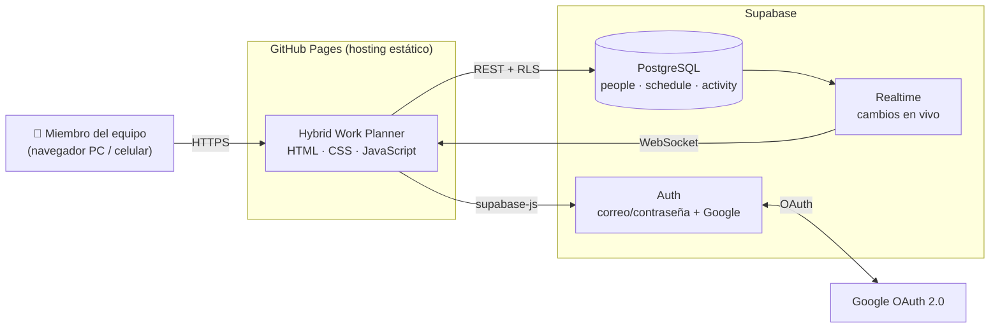
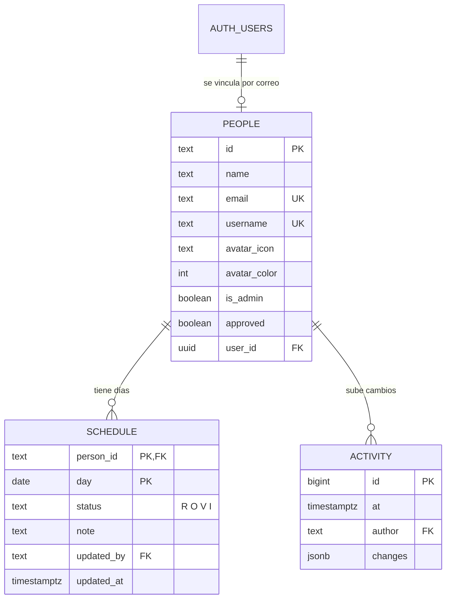

# Arquitectura — Hybrid Work Planner

## 1. Contexto

El equipo **Advisory · Tech Enablement** necesita saber quién va a la oficina y quién trabaja remoto cada día, respetando reglas de trabajo híbrido. Antes se hacía en Excel; esta app centraliza la información, aplica las reglas y muestra los cambios en tiempo real.

**Restricciones del entorno**
- No se puede instalar software en los equipos de la empresa.
- Sin presupuesto: todo debe funcionar en planes gratuitos.
- Debe usarse desde PC y celular.

---

## 2. Vista de contenedores (C4 – nivel 2)

| Contenedor | Responsabilidad |
|---|---|
| **App (GitHub Pages)** | Interfaz, reglas de negocio en el cliente, vistas semana/mes, editor |
| **Supabase Auth** | Registro, inicio de sesión, recuperación de contraseña, Google |
| **PostgreSQL** | Datos del equipo y seguridad a nivel de fila (RLS) |
| **Realtime** | Notifica a todos los navegadores cuando alguien sube cambios |

---

## 3. Organización del código

| Archivo | Contenido |
|---|---|
| `index.html` | Estructura: login, encabezado, vistas, diálogos |
| `css/styles.css` | Tokens de color (claro/oscuro), componentes y reglas responsive |
| `javascript/config.js` | Conexión a Supabase y parámetros de reglas |
| `javascript/data.js` | Feriados y quincenas (fuente: `calendario1.xlsx`) |
| `javascript/app.js` | Estado, reglas, renderizado, editor, perfil, administración, conexión |

**Secciones de `app.js`:** Utilidades → Estado → Semanas → Reglas → UI helpers → Render → Editor de día → Subir cambios → Perfil → Administrar equipo → Eventos → Tema → Conexión (Supabase) → Inicio.

---

## 4. Modelo de datos

**Decisiones del modelo**
- Solo se guardan los días **definidos**. Un día sin fila se muestra como "Sin definir"; los martes se muestran como Oficina por regla.
- Los **feriados y quincenas** no viven en la base: son datos fijos en `data.js`.
- `activity.changes` guarda cada cambio con su estado **antes** y **después**, para el historial.

---

## 5. Reglas de negocio

| Regla | Dónde se aplica |
|---|---|
| Martes presencial obligatorio (no puede ser Remoto) | Cliente (`normalize`, editor) |
| Máximo 2 días remotos por semana (los feriados reducen el cupo; vacaciones e incapacidad no) | Cliente (`weekCheck`, validación al subir) |
| Cada persona edita solo su calendario | Cliente **y** base de datos (RLS) |
| Solo se edita desde la semana actual en adelante (excepto admin) | Cliente **y** base de datos (RLS) |
| Feriados no editables | Cliente |

---

## 6. Seguridad

- **Row Level Security** activo en las tres tablas.
- Funciones `is_member()`, `my_person_id()` e `is_admin()` identifican al usuario por el correo de su sesión.
- Los perfiles solo permiten actualizar columnas seguras (`name`, `username`, `avatar_*`); `email` e `is_admin` se cambian solo desde Supabase.
- Operaciones de administración (`remove_person`, etc.) son funciones `security definer` que verifican `is_admin()`.
- La clave usada en el navegador es la **publicable**; la seguridad real la da RLS.

---

## 7. Flujos principales

**Registro / Google:** cuenta nueva en `auth.users` → trigger `handle_new_user` → crea o vincula la fila en `people` (con usuario automático si entró con Google).

**Editar y subir:** el usuario toca días → cambios quedan *pendientes* (borde naranja) → **Subir** valida la regla de remotos → `upsert` en `schedule` + `insert` en `activity` → Realtime actualiza a todo el equipo.

---

## 8. Límites conocidos (plan gratuito)

| Límite | Impacto | Mitigación |
|---|---|---|
| Proyecto se pausa tras 7 días sin uso | App fuera de línea | Reactivar desde el panel de Supabase |
| Correo integrado: 2 envíos/hora y solo a miembros de la organización | Recuperación de contraseña limitada | Usar login con Google o configurar SMTP propio |
| Sin copias de seguridad automáticas | Riesgo de pérdida de datos | Exportar periódicamente desde Supabase |
